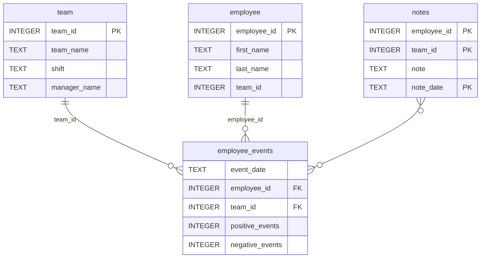
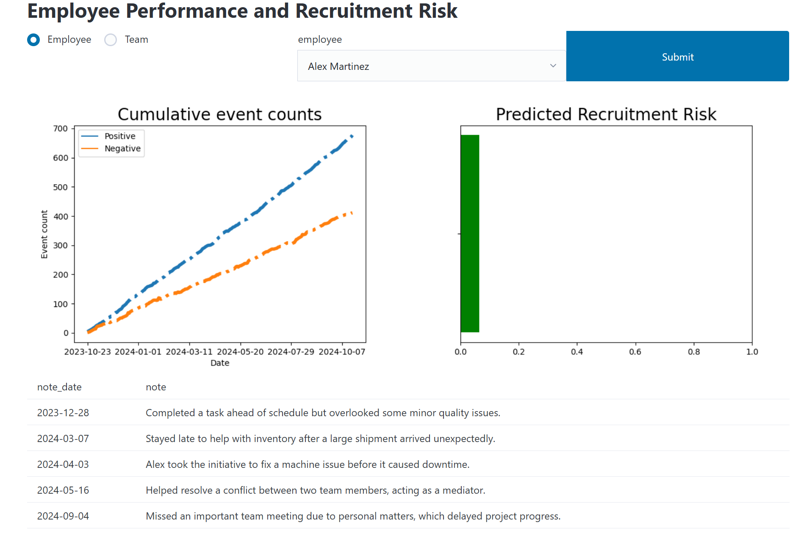

# Software Engineering for Data Scientists 


### Repository Structure
```
├── README.md
├── assets
│   ├── model.pkl
│   └── report.css
├── env
├── python-package
│   ├── employee_events
│   │   ├── __init__.py
│   │   ├── employee.py
│   │   ├── employee_events.db
│   │   ├── query_base.py
│   │   ├── sql_execution.py
│   │   └── team.py
│   ├── requirements.txt
│   ├── setup.py
├── report
│   ├── base_components
│   │   ├── __init__.py
│   │   ├── base_component.py
│   │   ├── data_table.py
│   │   ├── dropdown.py
│   │   ├── matplotlib_viz.py
│   │   └── radio.py
│   ├── combined_components
│   │   ├── __init__.py
│   │   ├── combined_component.py
│   │   └── form_group.py
│   ├── dashboard.py
│   └── utils.py
├── requirements.txt
├── start
├── tests
    └── test_employee_events.py
```

### employee_events.db



---

### Project Overview

This repository contains a small end‑to‑end data product for employee event analytics. It combines:

- A lightweight dashboard/report (under `report/`) to explore employee events, teams, and notes.
- A reusable Python package (under `python-package/employee_events/`) that provides a simple data access layer to a SQLite database (`employee_events.db`).
- Tests (under `tests/`) to validate the core data access logic.

The goal is to demonstrate software‑engineering practices for data science: packaging, modular UI components, separation of concerns, and testability.

### Dashboard at a Glance

The dashboard focuses on answering questions like:

- What positive/negative events are recorded for each employee or team over time?
- How do different teams compare by shift or manager?
- Which notes have been captured for specific employees/teams and on which dates?

Key UI elements and behaviors (implemented with small, composable components):

- Filters and inputs: `dropdown`, `radio`, and grouped form controls to select team, shift, date ranges, etc.
- Data view: a `data_table` component to display filtered rows from the underlying SQLite database.
- Visualizations: `matplotlib_viz` renders small charts (e.g., event counts over time, positive vs. negative bars) using Matplotlib and embeds them in the report.
- Styling: the `assets/report.css` file provides basic layout and theme for the report.

**Below, a static preview is demonstrated:**



### How to Run the Dashboard Locally

1. Create and activate a virtual environment (optional but recommended).
2. Install dependencies from the project root:

   ```bash
   pip install -r requirements.txt
   ```

3. Launch the dashboard/report. Depending on your environment, one of the following typically works:

   ```bash
   # Option A: run the module directly
   python -m report.dashboard

   # Option B: run the script path
   python report\dashboard.py
   ```

4. Open the printed URL (if applicable) or view the generated report output as instructed in the console.

### Running Tests

From the project root:

```bash
pytest -q
```

This will run `tests/test_employee_events.py` to validate the data access functions.

### Packaging and Reuse

The `python-package/employee_events/` directory is structured as an installable package. You can install it locally for reuse in notebooks or other apps.

You can import it as:

```python
from employee_events.employee import Employee
```

### Last Notes
- The project runs perfectly in Python `3.12`. 
- You can also use Python `3.10.10`
