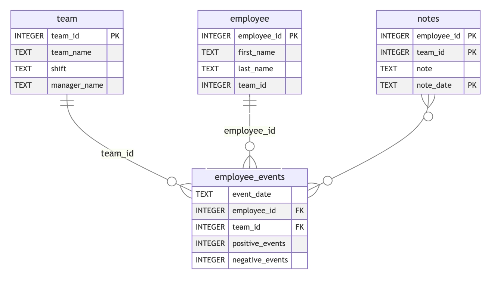

### Project Instructions

Below is a list of instructions for each project requirement. A checklist is provided at the bottom of this page to help you keep track of your progress.

**Your workspace for this project has Python and Git installed.**
**You will need to install any dependencies you need for this project yourself.**

#### Define a Python mixin or decorator

Inside the ```python-package/employee_events/sql_execution.py``` file, 
you are asked to write either a python decorator or a python mixin.

The mixin or decorator should be used to handle the following for all SQL queries

Opening a connection to the ```python-package/employee_events/employee_events.db``` SQLite database
1. Executing SQL queries using the open connection
2. Closing the connection to the database
3. Returning the data

**If you choose to use a decorator, the workflow should function something like this:**

```
@<decorator name>
def <function name>():
        return <sql query>

data = <function name>()
```

**If you choose to use a mixin, your mixin class should have methods for completing steps 1-4 above.** 

-----

### Define the ```QueryBase``` class and the subclasses ```Employee``` and ```Team```
`
For each of these classes, you will write SQL queries that query the employee_events.db SQLite database

- Queries that can be used for both employees and teams should be placed inside the QueryBase class.
- Queries specific to an employee or a team should be placed in their respective class

**Below is an entity relationship diagram of employee_events.db to help you write your queries**



-----

#### Install Python package

Using the command line, build and install the ```employee_events``` python package.